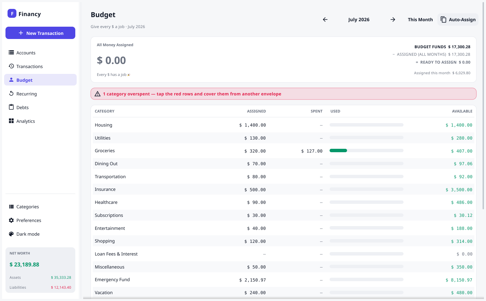

<div align="center">

# 💰 Financy

**Open-source zero-based budgeting (ZBB) for your desktop — give every dollar a job.**

A fast, local-first **zero-based budget** in a native desktop app: assign every unit
of money to a category until *Ready to Assign* hits zero, then watch your envelopes
through the month. Underneath it's **real double-entry accounting**, so your budget,
balances and net worth are all derived from one journal and can never drift out of
balance. Your data lives in a single file you own — no cloud, no account, no tracking.


&nbsp;
&nbsp;
&nbsp;
&nbsp;
&nbsp;

📖 **[Read the documentation](https://raihanstark.github.io/financy/docs/)** · 🌐 **[Website](https://raihanstark.github.io/financy/)**



</div>

---

## ✨ Features

- 🎯 **Zero-based budgeting** — the heart of the app. Every month, give each category a job until **Ready to Assign** reaches zero. Track **Assigned · Activity · Available** per category, with envelope balances that roll forward and overspending shown in red. One-tap quick-budget suggestions (last month's assigned/spent, 3-month average) and **Auto-Assign** to copy a month's plan.
- 💰 **A Ready-to-Assign that's honest** — it's a single pool drawn from your real **on-budget account balances** (assets net of credit-card debt), so money assigned to any month — even a future one — draws it down, and you can never assign money you don't have.
- 💳 **Credit cards done right** — spending on a card depletes its envelope *and* nets against the budget, so it's budget-neutral the way a good ZBB tool should be. Mark investments or a mortgage as **off-budget** so they count toward net worth but not assignable cash.
- 🔒 **Locked history** — past months are view-only; you budget the current month and beyond, and a budget you've already lived through can't be rewritten.
- 📒 **Real double-entry accounting under the hood** — every transaction is balanced postings that sum to zero, so your budget, balances and net worth are *derived* from one journal and can never go inconsistent.
- 💵 **Proper money handling** — amounts are stored as integer minor units (cents), with per-currency formatting for **Rp · $ · € · £** (no floating-point money, ever).
- 🏦 **Accounts & net worth** — asset & liability cards, a net-worth overview, and a per-account **register with running balance**.
- 🧾 **Transactions** — a clean, date-grouped journal with a familiar **Income / Expense / Transfer** entry form, live filters and search, plus a **bulk-select mode** to recategorize many entries at once.
- 📊 **Analytics & Reports** — KPIs, income-vs-expenses, net-worth-over-time and spending-by-category charts, plus the three financial statements (Income Statement, Balance Sheet, Cash Flow) — all derived from the journal, so they never drift from your transactions.
- 💾 **Local-first persistence** — each document is a single **`.financy` SQLite file** that is *always auto-saved* (ACID writes — no save button, no lost work).
- ⚡ **Quick start** — first-run setup lets you **load demo data** (a complete worked budget) or **start from scratch** with your chosen currency.
- 🔐 **Safe by design** — atomic writes, append-only schema migrations, and an automatic `.bak` before any file upgrade.

---

## 📸 Screenshots

<div align="center"></div>

| Accounts & net worth | Analytics |
| :-: | :-: |
|  |  |

| Transactions | First-run setup |
| :-: | :-: |
|  |  |

---

## 🚀 Getting Started

### Install (Linux packages)

Grab the `.deb` or `.rpm` for the latest release from the
[Releases page](https://github.com/raihanstark/financy/releases/latest):

```sh
# Debian / Ubuntu
sudo apt install ./Financy-vX.Y.Z-linux-amd64.deb

# Fedora / RHEL / openSUSE
sudo dnf install ./Financy-vX.Y.Z-linux-x86_64.rpm
```

This installs the `financy` command, a desktop launcher, and registers the
`.financy` file type so you can double-click documents to open them.

### Prerequisites (building from source)
- **Go 1.25+**
- A C toolchain + OpenGL/X11 dev headers (Fyne requirement). On Debian/Ubuntu:
  ```sh
  sudo apt-get install gcc pkg-config libgl1-mesa-dev xorg-dev
  ```

### Run it
```sh
go run .        # or: make run
```

### Build a binary
```sh
make build      # produces ./financy with the version stamped in
```

On first launch you'll be greeted with a setup dialog — pick **Load demo data (USD)**
to explore, or **Start from scratch** and choose your currency. Then choose where to
save your `.financy` file.

---

## 🧭 Usage

- **Budget the month** — open **💰 Budget**, then click a category to assign money
  (with quick-budget suggestions) until **Ready to Assign** is zero. Navigate months
  with ◀ ▶, **Auto-Assign** to copy last month, and **+ Add Category** to grow your plan.
- **Add a transaction** — the toolbar **`+`**, or the *Add Transaction* button. Choose
  Income / Expense / Transfer; the app writes the correct double-entry postings for you,
  and the spending flows straight into your budget's *Activity*.
- **Open an account's register** — click an account card. Right-click a card (or use the
  **⋮** button) for *New Transaction · View Register · Edit · Delete*.
- **Filter the journal** — by month, type, account, or free-text search.
- **See your trends** — the **📊 Analytics** screen shows KPIs and charts over This month / Last 3 / 6 / 12 / Year to date; hover any month for a tooltip.
- **Manage categories & currency** — the **⚙ Preferences** dialog (Configuration · Categories · Data Summary).
- **Files** — `File ▸ New / Open / Open Recent / Save a Copy / Close`.

---

## 💾 Your Data

- Each document is a self-contained **SQLite** database with a `.financy` extension —
  move it, back it up, or drop it in a cloud folder (while the app is closed).
- It's **always saved** as you work (ACID writes). There is no "Save" button.
- **Save a Copy** snapshots the document elsewhere; opening an older file makes a `.bak`
  before migrating it to the current schema.

> ⚠️ SQLite isn't built for two machines editing the same file at once — don't open the
> same `.financy` from multiple devices simultaneously.

---

## 🏗️ Architecture

```
main.go                  entry point (embeds the icon, calls ui.Run)
internal/
  core/                  domain model · double-entry Store · SQLite · formatting   (no UI deps)
  ui/
    style/               palette + theme
    component/           reusable widgets (cards, table, rows, app bar, tooltips, charts)
    view/                screens (Budget, Accounts, Transactions, Analytics, Reports) + Preferences + forms
    (root)               app shell, controller, toolbar, File menu, document manager
```

The **`core`** package has zero UI dependencies and holds all the accounting logic, so it's
independently testable — that's where new logic and tests belong.

---

## 🛠️ Development

```sh
make check      # build + vet + test   (run before committing)
make test       # tests only
make run        # run the app
make shot       # regenerate screenshots (into /tmp/financy-shots)
```

**Two rules that protect user data:**
1. **Migrations are append-only** — add a new entry to `migrations` in `internal/core/db.go`; never edit an existing one.
2. **Money stays integer minor units** — never introduce floats for money.

---

## 🚢 Releasing

```sh
make release VERSION=0.2.0     # stamps version, verifies, builds
git commit -am "Release v0.2.0"
git tag v0.2.0 && git push --tags
```

Pushing a `v*` tag triggers CI to package **Linux / Windows / macOS** bundles and attach
them to the GitHub Release. See [RELEASING.md](RELEASING.md) for the full guide.

---

## 🧰 Tech Stack

- **[Go](https://go.dev)** — application language
- **[Fyne](https://fyne.io)** — cross-platform native GUI
- **[modernc.org/sqlite](https://pkg.go.dev/modernc.org/sqlite)** — pure-Go SQLite (no cgo for the DB)

---

## ❤️ Support the Project

Financy is free and open-source, built and maintained in my spare time. If it helps you
give every dollar a job, please consider [**sponsoring on GitHub**](https://github.com/sponsors/RaihanStark) —
it directly funds continued development and is hugely appreciated. A ⭐ on the repo helps too!

---

## 📄 License

Released under the [MIT License](LICENSE).
