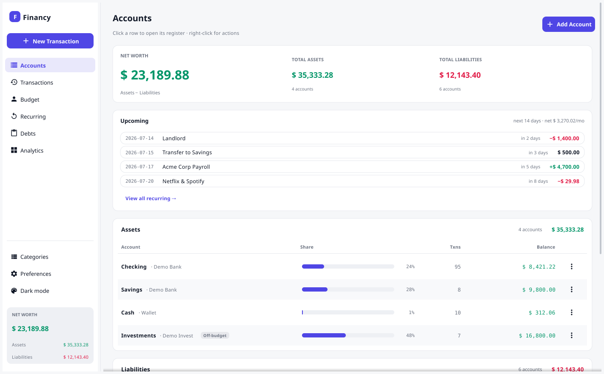
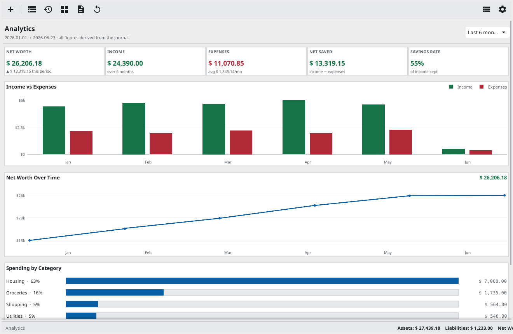
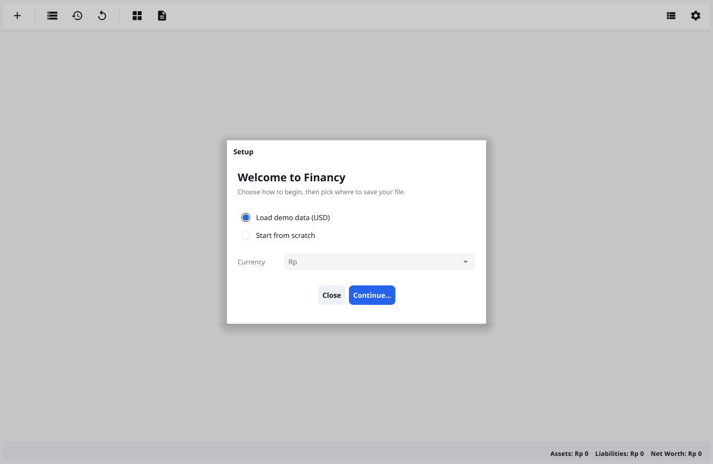
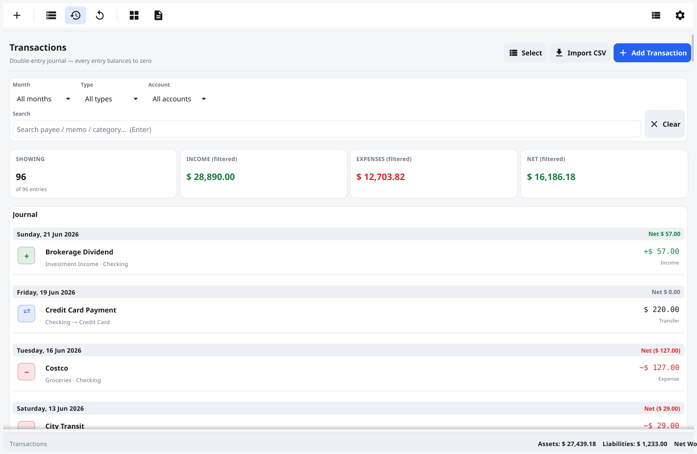
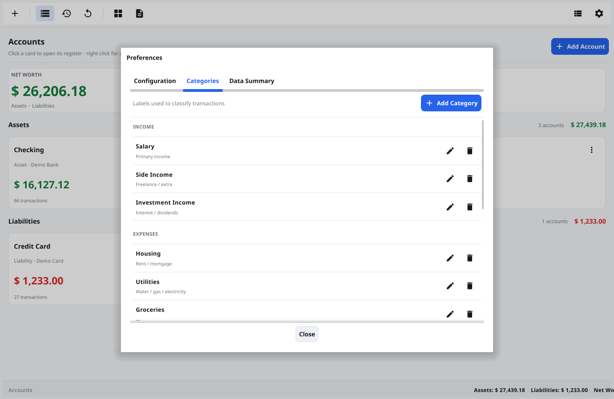
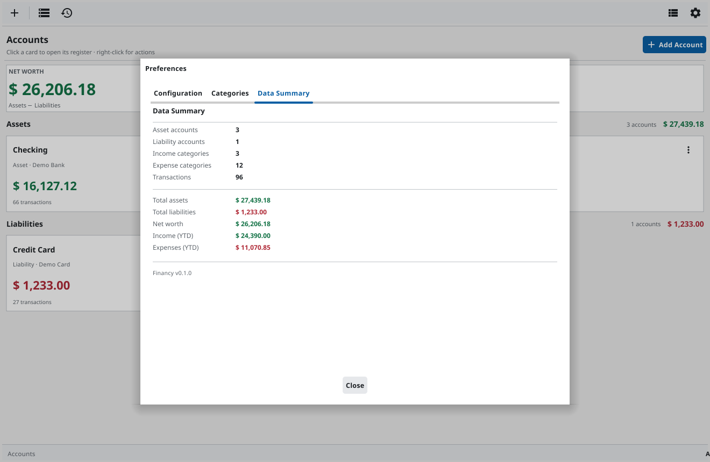

<div align="center">

# 💰 Financy

**A fast, local-first personal finance manager built on real double-entry accounting.**

Track accounts, money movements and net worth in a native desktop app — your data
lives in a single file you own, and the books can never drift out of balance.


&nbsp;
&nbsp;
&nbsp;
&nbsp;

📖 **[Read the documentation](https://raihanstark.github.io/financy/docs/)** · 🌐 **[Website](https://raihanstark.github.io/financy/)**



</div>

---

## ✨ Features

- 📒 **Real double-entry accounting** — every transaction is balanced postings that sum to zero, so balances and net worth are *derived* and can never go inconsistent.
- 💵 **Proper money handling** — amounts are stored as integer minor units (cents), with per-currency formatting for **Rp · $ · € · £** (no floating-point money, ever).
- 🏦 **Accounts** — asset & liability cards, a net-worth overview, and a per-account **register with running balance**.
- 🧾 **Transactions** — a clean, date-grouped journal with a familiar **Income / Expense / Transfer** entry form, live filters and search, plus a **bulk-select mode** to recategorize many entries at once.
- 🏷️ **Categories** — organise income & expenses; managed from Preferences.
- 📊 **Analytics** — a read-only insights dashboard: KPIs (net worth & change, income, expenses, net saved, savings rate), an **income-vs-expenses** bar chart, a **net-worth-over-time** line, and **spending by category** — over a selectable period (This month / Last 3 / 6 / 12 / Year to date). Charts are drawn natively with axis labels and hover tooltips.
- 📄 **Reports** — the three core financial statements as tabs: an **Income Statement** (P&L), a **Balance Sheet** (assets, liabilities & equity that always balances), and a **Cash Flow** — all derived from the journal over the same selectable period, so they can never drift from your transactions.
- 🖱️ **Desktop-native UX** — right-click **context menus**, hover **tooltips**, an icon toolbar and a minimal File menu.
- 💾 **Local-first persistence** — each document is a single **`.financy` SQLite file** that is *always auto-saved* (ACID writes — no save button, no lost work).
- 📂 **Your files, your way** — New / Open / Open Recent / Save a Copy; opens your last file on launch.
- ⚡ **Quick start** — first-run setup lets you **load demo data** or **start from scratch** with your chosen currency.
- 🔒 **Safe by design** — atomic writes, append-only schema migrations, and an automatic `.bak` before any file upgrade.

---

## 📸 Screenshots

<div align="center"></div>

| First-run setup | Transactions |
| :-: | :-: |
|  |  |

| Categories (Preferences) | Data summary |
| :-: | :-: |
|  |  |

---

## 🚀 Getting Started

### Prerequisites
- **Go 1.25+**
- A C toolchain + OpenGL/X11 dev headers (Fyne requirement). On Debian/Ubuntu:
  ```sh
  sudo apt-get install gcc pkg-config libgl1-mesa-dev xorg-dev
  ```

### Run it
```sh
go run .        # or: make run
```

### Build a binary
```sh
make build      # produces ./financy with the version stamped in
```

On first launch you'll be greeted with a setup dialog — pick **Load demo data (USD)**
to explore, or **Start from scratch** and choose your currency. Then choose where to
save your `.financy` file.

---

## 🧭 Usage

- **Add a transaction** — the toolbar **`+`**, or the *Add Transaction* button. Choose
  Income / Expense / Transfer; the app writes the correct double-entry postings for you.
- **Open an account's register** — click an account card. Right-click a card (or use the
  **⋮** button) for *New Transaction · View Register · Edit · Delete*.
- **Filter the journal** — by month, type, account, or free-text search.
- **See your trends** — the **📊 Analytics** screen shows KPIs and charts over This month / Last 3 / 6 / 12 / Year to date; hover any month for a tooltip.
- **Manage categories & currency** — the **⚙ Preferences** dialog (Configuration · Categories · Data Summary).
- **Files** — `File ▸ New / Open / Open Recent / Save a Copy / Close`.

---

## 💾 Your Data

- Each document is a self-contained **SQLite** database with a `.financy` extension —
  move it, back it up, or drop it in a cloud folder (while the app is closed).
- It's **always saved** as you work (ACID writes). There is no "Save" button.
- **Save a Copy** snapshots the document elsewhere; opening an older file makes a `.bak`
  before migrating it to the current schema.

> ⚠️ SQLite isn't built for two machines editing the same file at once — don't open the
> same `.financy` from multiple devices simultaneously.

---

## 🏗️ Architecture

```
main.go                  entry point (embeds the icon, calls ui.Run)
internal/
  core/                  domain model · double-entry Store · SQLite · formatting   (no UI deps)
  ui/
    style/               palette + theme
    component/           reusable widgets (cards, table, rows, app bar, tooltips, charts)
    view/                screens (Accounts, Transactions, Analytics) + Preferences + forms
    (root)               app shell, controller, toolbar, File menu, document manager
```

The **`core`** package has zero UI dependencies and holds all the accounting logic, so it's
independently testable — that's where new logic and tests belong.

---

## 🛠️ Development

```sh
make check      # build + vet + test   (run before committing)
make test       # tests only
make run        # run the app
make shot       # regenerate screenshots (into /tmp/financy-shots)
```

**Two rules that protect user data:**
1. **Migrations are append-only** — add a new entry to `migrations` in `internal/core/db.go`; never edit an existing one.
2. **Money stays integer minor units** — never introduce floats for money.

---

## 🚢 Releasing

```sh
make release VERSION=0.2.0     # stamps version, verifies, builds
git commit -am "Release v0.2.0"
git tag v0.2.0 && git push --tags
```

Pushing a `v*` tag triggers CI to package **Linux / Windows / macOS** bundles and attach
them to the GitHub Release. See [RELEASING.md](RELEASING.md) for the full guide.

---

## 🧰 Tech Stack

- **[Go](https://go.dev)** — application language
- **[Fyne](https://fyne.io)** — cross-platform native GUI
- **[modernc.org/sqlite](https://pkg.go.dev/modernc.org/sqlite)** — pure-Go SQLite (no cgo for the DB)

---

## 📄 License

Released under the [MIT License](LICENSE).
